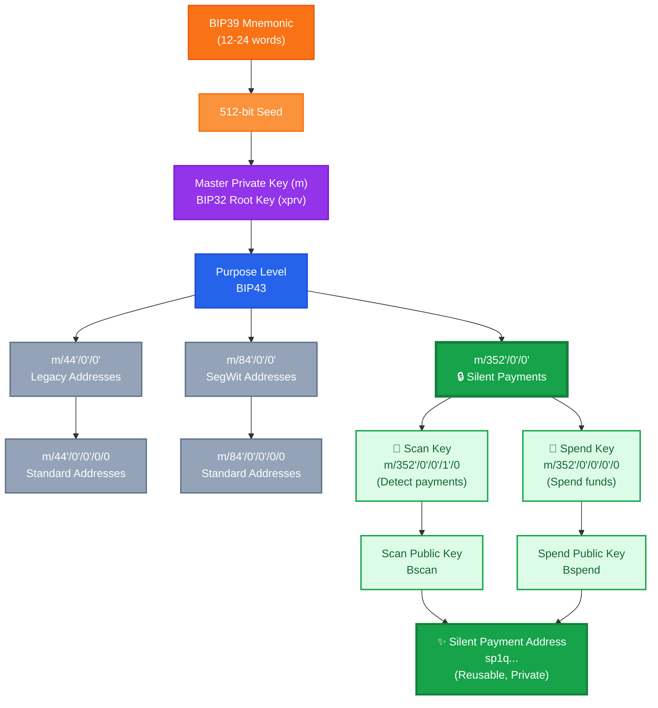

# Bitcoin Silent Payments (BIP 352)

## Overview

Silent Payments is a privacy-enhancing protocol for Bitcoin that allows recipients to publish a single, reusable payment address while receiving payments to unique, unlinkable on-chain addresses. This eliminates address reuse without requiring interactive communication between sender and receiver.

**Current Status**: BIP 352 is in "Proposed" status (not Final or Active) as of version 1.0.2 (July 2025). The protocol requires no consensus changes and can be implemented by wallets independently, though implementations should be considered early-stage and thoroughly tested.

## The Problem

Traditional Bitcoin best practices create a UX dilemma:

- **Address Reuse**: Convenient but terrible for privacy - all payments are publicly linked
- **Unique Addresses**: Good for privacy but requires generating and sharing a new address for each payment
- **Use Cases Affected**: Donation pages, tip jars, static payment endpoints, and any scenario requiring a persistent payment address

## How Silent Payments Work

Silent Payments use elliptic curve Diffie-Hellman (ECDH) key exchange to enable non-interactive address derivation:

1. **Recipient** generates and publishes a static silent payment address (format: `sp1q...`)
2. **Sender** combines the recipient's public keys with their own private transaction keys to derive a unique Taproot output address
3. **Blockchain** records a standard Taproot (P2TR) output (`bc1p...`)
4. **Recipient** scans the blockchain using their scan key to detect payments and uses their spend key to access funds

### Cryptographic Process

Each payment generates a unique shared secret between sender and receiver:

```
Shared Secret = input_hash · sender_private_key · receiver_scan_pubkey
Output Address = receiver_spend_pubkey + hash(shared_secret || k) · G
```

Where:
- `input_hash` = hash of the smallest outpoint and sum of sender's input public keys
- `k` = output index starting at 0 (allows multiple outputs to same recipient in one transaction)
- `G` = generator point on the secp256k1 curve

**Critical implementation detail**: For Taproot inputs, X-only public keys require Y-coordinate parity checking. If a sender's private key produces a point with an odd Y-coordinate, the private key must be negated before computing the shared secret to maintain consistency with the receiver's calculations.

## Key Derivation (BIP 32/39 Compatible)

Silent Payments are fully compatible with hierarchical deterministic wallets:

### HD Wallet Tree Visualization

Below is a visual representation of how Silent Payments fit into the BIP39/BIP32 hierarchical deterministic wallet structure:

#### BIP39 HD Wallet Tree with Silent Payments


### Derivation Path (BIP 352)

```
m/352'/0'/0'
    ├─ m/352'/0'/0'/0'/0  →  Spend Private Key
    └─ m/352'/0'/0'/1'/0  →  Scan Private Key
```

- **Purpose**: `352'` (from BIP 352)
- **Coin Type**: `0'` (Bitcoin mainnet)
- **Account**: `0'` (first account)

### Two-Key Architecture

**Spend Key**: Used to create signatures and spend received funds. Must be kept secure.

**Scan Key**: Used to detect incoming payments by scanning the blockchain. Can be shared with watch-only wallets or servers without compromising spending ability.

The silent payment address is constructed from the public keys of both:

```
Silent Payment Address = encode(scan_pubkey, spend_pubkey)
```

### Extended Key Format

Silent Payments use standard BIP32 extended keys with **xprv/xpub** prefixes, not yprv/ypub or zprv/zpub variants:

- **xprv/xpub** - Standard BIP32 extended keys (used for Silent Payments)
- **yprv/ypub** - P2WPKH-nested-in-P2SH (wrapped SegWit)
- **zprv/zpub** - Native P2WPKH (native SegWit)

Even though Silent Payments produce **Taproot outputs** (bc1p...) on-chain, the derivation uses standard xprv/xpub because:

1. BIP 352 specifies standard BIP32 derivation
2. The y/z prefixes were created to signal specific address types, but Silent Payments have their own unique format (`sp1q...`)
3. The output type (Taproot) is independent of the derivation standard (BIP32)

This ensures compatibility with existing HD wallet infrastructure while maintaining the unique properties of Silent Payments.

## Address Type Requirements

**Critical**: Silent Payments are **Taproot-only** for outputs (P2TR) but support multiple input types.

### Output Type: Taproot Only

All Silent Payment outputs **must** be Taproot (P2TR) addresses:
- Your reusable address: `sp1q...` (shared publicly)
- Actual on-chain outputs: `bc1p...` (Taproot addresses)
- **Not compatible** with Legacy (P2PKH), SegWit (P2WPKH), or nested SegWit outputs

### Input Types: Flexible Backward Compatibility

**Senders can use the following input types** to create Silent Payments:
- ✅ P2TR (Taproot) — both keypath and scriptpath spends
- ✅ P2WPKH (Native SegWit v0)
- ✅ P2SH-P2WPKH (Wrapped SegWit)
- ✅ P2PKH (Legacy, compressed keys only)

**Excluded input types:**
- ❌ Multisig scripts (P2SH, P2WSH)
- ❌ Future SegWit versions beyond v1
- ❌ Any inputs with conditional branches enabling malleability

This means users can send Silent Payments from legacy wallets, even though the outputs created are always modern Taproot addresses.

### Why Taproot-Only Outputs?

- **Uniformity**: All outputs look like standard Taproot transactions, providing privacy through blending with other Taproot usage
- **Key Tweaking**: Taproot's key-path spending enables efficient public key derivation required by the protocol
- **Modern Standard**: Best privacy and efficiency characteristics
- **Cryptographic Compatibility**: The protocol requires Taproot's key structure
- **Anonymity Set**: As Taproot adoption grows, Silent Payments benefit from larger anonymity sets

The specification explicitly states: "Providing too much optionality for the protocol makes it difficult to implement and can be at odds with the goal of providing the best privacy."

## Privacy Analysis

### What Silent Payments Provide

✅ **Eliminates address reuse**: Each payment creates a unique on-chain address  
✅ **Prevents third-party linkability**: Outside observers cannot connect multiple payments to the same recipient  
✅ **Reusable payment codes**: One address can be published indefinitely  
✅ **No trusted third parties**: No payment servers or address generation services required  
✅ **Forward secrecy**: Past transactions remain private even if future keys are compromised

### Privacy Limitations

⚠️ **Sender surveillance**: The sender knows which specific UTXO they created and can monitor its future spending  
⚠️ **Blockchain scanning required**: Recipients must scan all Taproot outputs to detect payments (significant computational and bandwidth overhead)  
⚠️ **Light client challenges**: Scanning requires approximately 30-50 MB/month bandwidth (as of 2024 data) and ECDH computation for every eligible transaction. Standard BIP 158 compact block filters are not effective. Light client support remains "an area of open research" per the specification.  
⚠️ **No sender anonymity**: The sender's inputs are visible on-chain as with any Bitcoin transaction  
⚠️ **Coin control still matters**: Combining UTXOs can reveal common ownership  
⚠️ **Label linkability**: Labeled addresses sharing the same scan key are publicly linkable on-chain by anyone who can identify the common scan key

### Threat Model: Sender Surveillance

When a sender makes a silent payment, they can:

1. Calculate the exact `bc1p...` address they paid to
2. Monitor when that UTXO is spent
3. Observe what addresses it's sent to
4. See what other UTXOs it's combined with (revealing additional holdings)
5. Track spending patterns and timing

**This is not unique to Silent Payments** - all Bitcoin payment methods have this property. The sender always knows where they sent funds.

## Privacy Best Practices for Recipients

To maintain privacy after receiving silent payments:

1. **Coin Control**: Avoid unnecessary UTXO consolidation that reveals common ownership
2. **CoinJoin**: Use privacy-enhancing mixing before spending
3. **Timing**: Introduce delays between receiving and spending
4. **Compartmentalization**: Use separate wallets for different contexts
5. **Lightning Network**: Move funds to Lightning channels to obscure on-chain activity
6. **Avoid Change Address Reuse**: Ensure change outputs don't link transactions

## Technical Trade-offs

### Advantages

- Reusable addresses without privacy loss
- No interactive communication required
- Self-sovereign (no trusted third parties)
- Fully deterministic and recoverable from seed
- Compatible with existing HD wallet infrastructure

### Disadvantages

- Scanning overhead for recipients (must check every Taproot output)
- **Light client support extremely challenging**: Requires ~30-50 MB/month bandwidth based on current Taproot adoption (as of 2024 data), full ECDH computation per transaction, and cannot use standard compact block filters effectively. Mobile wallets may need to rely on trusted scanning servers, reintroducing privacy concerns.
- Slightly larger transaction sizes
- Limited wallet support (as of 2025, still early-stage adoption)
- Taproot-only (no backwards compatibility with older address types)
- Requires sender wallet support
- **Collaborative transactions lack formal security proof**: CoinJoin, MuSig, and FROST scenarios may require additional cryptographic proofs (Blind DH, DLEQ) to prevent malicious participants from learning private keys

## Implementation Considerations

### For Wallet Developers

- Implement BIP 352 derivation paths (m/352'/0'/0')
- Support Taproot output creation for sending
- Accept multiple input types (P2TR, P2WPKH, P2SH-P2WPKH, P2PKH) for backward compatibility
- Implement efficient blockchain scanning algorithms with proper edge case handling
- Consider light client scanning optimizations or trusted server delegation
- Provide clear UX around scanning requirements and bandwidth costs
- **Implement SIGHASH restrictions**: Prohibit `SIGHASH_ANYONECANPAY` (critical security requirement - allows inputs to change after outputs are derived, breaking receiver's ability to compute correct shared secret)
- **Handle edge cases**: Zero private key sums (fail), point at infinity (skip), hash outputs equaling zero or exceeding curve order (fail)
- **Taproot input handling**: Check Y-coordinate parity and negate keys if necessary
- **Collaborative transactions**: Be aware that CoinJoin/MuSig/FROST usage lacks formal security proofs and may require additional cryptographic protections

### For Users

- Ensure both sender and receiver wallets support Silent Payments
- Understand that receiving requires blockchain scanning (bandwidth and computation costs)
- Be aware of computational requirements for mobile devices
- Practice good UTXO management to avoid revealing common ownership
- Recognize that sender can monitor the specific UTXO they created
- **Label privacy**: If using labeled addresses, understand they are linkable on-chain to anyone who identifies the common scan key
- Consider using change outputs (label m=0) only internally, never share with external parties

## Comparison to Alternatives

| Feature | Silent Payments | Stealth Addresses | BIP 47 | Address Rotation |
|---------|----------------|-------------------|--------|------------------|
| Reusable Address | ✅ | ✅ | ✅ | ❌ |
| No Interaction Required | ✅ | ✅ | ❌ | ❌ |
| No Blockchain Bloat | ✅ | ❌ | ❌ | ✅ |
| Light Client Friendly | ⚠️ | ⚠️ | ✅ | ✅ |
| No Address Linkability | ✅ | ✅ | ✅ | ⚠️ |

## Wallet Support

As of 2025, Silent Payments support is emerging with early-stage implementations:

**Wallets with support:**
- **Cake Wallet** - Full send and receive support
- **BitBox02** - Hardware wallet with send-only support
- **Blue Wallet** - Added support in 2024
- **Wasabi Wallet** - Send-only support

**Implementation tracking:**
- Bitcoin Core: Issue #28536, PR #28122 (in progress)
- libsecp256k1: Module PR #1519

Check current wallet compatibility before relying on this feature for production use. Implementations should be thoroughly tested, especially for edge cases in transaction construction and collaborative scenarios.

## Technical Resources

- **BIP 352**: Bitcoin Improvement Proposal defining Silent Payments specification
  - Primary: [github.com/bitcoin/bips/blob/master/bip-0352.mediawiki](https://github.com/bitcoin/bips/blob/master/bip-0352.mediawiki)
  - Readable: [bips.dev/352](https://bips.dev/352)
  - Wiki: [en.bitcoin.it/wiki/BIP_0352](https://en.bitcoin.it/wiki/BIP_0352)
- **Status**: Proposed (version 1.0.2, July 2025)
- **Authors**: josibake and Ruben Somsen
- **Bitcoin Optech**: [bitcoinops.org/en/topics/silent-payments](https://bitcoinops.org/en/topics/silent-payments/)
- **Silent Payments Site**: [silentpayments.xyz](https://silentpayments.xyz/)
- **BIP 32**: Hierarchical Deterministic Wallets
- **BIP 39**: Mnemonic code for generating deterministic keys
- **BIP 341**: Taproot specification
- **BIP 350**: Bech32m address format

## Security Considerations

- **Backup Your Seed**: Silent payment keys are derived from your HD wallet seed
- **Scan Key Exposure**: Sharing scan keys allows detection but not spending - enables watch-only setups but leaks privacy if compromised
- **Implementation Review**: Ensure wallet implementations are audited for edge cases
- **Key Management**: Follow standard Bitcoin key security practices
- **Transaction Analysis**: Be aware that transaction graph analysis can still reveal patterns
- **SIGHASH Requirements**: Only use `SIGHASH_ALL` or `SIGHASH_DEFAULT` - never `SIGHASH_ANYONECANPAY`
- **Collaborative Transactions**: Use with caution in CoinJoin/MuSig scenarios due to lack of formal security proofs
- **Edge Cases**: Implementations must handle zero sums, point at infinity, and invalid hash outputs correctly
- **Quantum Resistance**: Silent Payments have identical quantum vulnerability to standard Bitcoin (ECDLP-based, vulnerable to Shor's algorithm)

## Future Developments

Potential improvements being discussed:

- Light client scanning optimizations (currently an open research problem)
- UTXO set filters for efficient detection
- Cross-input signature aggregation for efficiency
- Extended protocol features
- Broader wallet ecosystem adoption
- Formal security proofs for collaborative transaction scenarios (CoinJoin, MuSig, FROST)
- Trusted scanning server protocols that preserve privacy

## Conclusion

Silent Payments represent a significant privacy improvement for Bitcoin, solving the address reuse problem without requiring interactive protocols or trusted third parties. However, they are not a silver bullet - users must still practice good privacy hygiene, and the threat of sender surveillance remains as with all Bitcoin payments.

**Key limitations to understand:**
- **Light client support**: Currently requires ~30-50 MB/month bandwidth (based on 2024 Taproot adoption data) and computational resources, making mobile implementation challenging without trusted servers
- **Collaborative transactions**: Lack formal security proofs for CoinJoin/MuSig/FROST scenarios
- **Scanning requirements**: Recipients must actively scan the blockchain, unlike address-based wallets
- **Early adoption**: As of 2025, wallet support is limited and implementations should be considered early-stage

**Best suited for:**
- Donation addresses
- Merchant payment endpoints  
- Recurring payments
- Any scenario requiring a persistent, shareable payment address
- **Desktop/server environments** with reliable connectivity and computational resources

**May not be suitable for:**
- Light clients on mobile devices (without trusted scanning servers)
- Scenarios requiring instant payment detection
- Users with limited bandwidth or computational resources

As wallet support matures and light client solutions improve, Silent Payments may become a standard privacy feature in the Bitcoin ecosystem. The protocol successfully revives and perfects the decade-old stealth address concept with modern cryptographic best practices.

---

**Note**: This document reflects the state of Bitcoin Silent Payments as of October 2025 with BIP 352 in "Proposed" status (version 1.0.2). Always consult the latest specification and wallet documentation for current implementation details and security considerations.